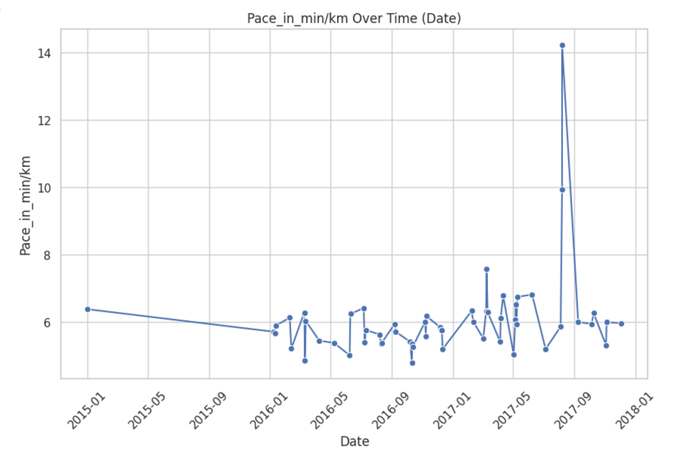
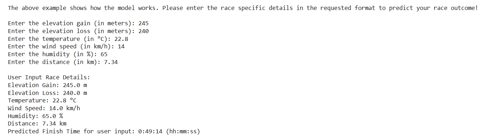

# 🏃 Event Performance Predictor  

Welcome to the **Event Performance Predictor**, a machine learning project designed to estimate an athlete's event finish time based on historical performance data, physiological metrics, and race-specific details. This tool helps athletes set realistic goals and optimize race strategies.  

## 🌟 Highlights  

- **🎯 Purpose**: Predict finish time for upcoming events (e.g., Race Day).  
- **📊 Key Variables**: Utilized physiological, performance, and environmental metrics, such as:
  - **Heart Rate** (Average, Max, Min)  
  - **VO2 Max**  
  - **Elevation Gain & Loss**  
  - **Pace** and **Distance**  
- **🤖 Machine Learning Models**: Compared multiple regression models to determine the best predictor.  
- **📈 Performance Insights**: Visualized performance trends over time for better understanding.  

## 🛠️ Key Objectives  

1. **Data Preparation**: Extract and compute key metrics, including Pace, VO2 Max, and Running Efficiency.  
2. **Model Development**: Evaluate regression models such as Linear Regression, Random Forest, and Gradient Boosting.  
3. **Prediction**: Provide accurate finish time predictions using the best model.  
4. **User Interaction**: Allow user inputs for race-specific predictions.  

## 📚 The Dataset  

### Variables Used:  
1. **Physiological Variables**: Heart Rate, HRR, VO2 Max, etc.  
2. **Performance Metrics**: Average Speed, Pace.  
3. **Environmental Factors**: Temperature, Elevation, Wind Speed, and Humidity.  
4. **Target Variable**: **Running Duration** (Finish Time).  

### Source:  
Data sourced from the dataset `Fixed_cleaned_activities.csv`, representing multiple training sessions for a single athlete.

## 🔬 Model Insights  

### Best Models Evaluated:  
- **Linear Regression**: Best performer with low error metrics.  
- **Gradient Boosting**: Strong contender with slightly higher errors.  
- **Decision Tree**: Robust alternative with competitive performance.  

### Results (Top Model - Linear Regression):  
- **MAE**: 0.024  
- **MSE**: 0.002  
- **R² Score**: 0.98  

### Visualization:  
- Metrics over time: Pace, VO2 Max, HRR, and Efficiency trends.  

## 💡 Why This Matters  

This project showcases the application of machine learning to sports analytics, providing athletes with actionable insights:  
- **🏁 Goal Setting**: Helps athletes strategize based on predicted performance.  
- **📉 Data-Driven Decisions**: Incorporates physiological and environmental data for precision.  
- **🌍 General Applications**: Can extend to other sports or activities.  

## 📁 Repository Contents  

- **Code**: Python scripts for data preprocessing, modeling, and prediction.  
- **Visualizations**: Time-series plots of performance metrics.  
- **Results**: Evaluation metrics for each model and final predictions.  

## 🛠️ How It Works  

1. **Input Historical Data**: Calculate averages for key metrics over the past six months.  
2. **Enter Race-Specific Details**: Input variables such as elevation, temperature, and distance.  
3. **Predict Finish Time**: Model estimates time in a user-friendly format (`hh:mm:ss`).  

## 📸 Screenshots  

Take a glimpse of the work:  

  
  

## 📬 Contact  

Explore, contribute, or connect! For inquiries or feedback, reach out to me at [sathiyanarayanan.s1698@gmail.com](mailto:sathiyanarayanan.s1698@gmail.com). 

---

**✨ Ready to predict your performance? Let's get started!**  
